---
## Front matter
lang: ru-RU
title: Лабораторная работа № 2
subtitle: Дискреционное разграничение прав в Linux. Основные атрибуты
author:
  - Cадова Д. А.
institute:
  - Российский университет дружбы народов, Москва, Россия

## i18n babel
babel-lang: russian
babel-otherlangs: english
## Fonts
mainfont: PT Serif
romanfont: PT Serif
sansfont: PT Sans
monofont: PT Mono
mainfontoptions: Ligatures=TeX
romanfontoptions: Ligatures=TeX
sansfontoptions: Ligatures=TeX,Scale=MatchLowercase
monofontoptions: Scale=MatchLowercase,Scale=0.9

## Formatting pdf
toc: false
toc-title: Содержание
slide_level: 2
aspectratio: 169
section-titles: true
theme: metropolis
header-includes:
 - \metroset{progressbar=frametitle,sectionpage=progressbar,numbering=fraction}
 - '\makeatletter'
 - '\beamer@ignorenonframefalse'
 - '\makeatother'
---

# Информация

## Докладчик

:::::::::::::: {.columns align=center}
::: {.column width="70%"}

  * Садова Диана Алексеевна
  * студент бакалавриата
  * Российский университет дружбы народов
  * [113229118@pfur.ru]
  * <https://DianaSadova.github.io/ru/>

:::
::::::::::::::

# Вводная часть

## Актуальность

- Закрепляем опыт работы с разными провами файла 

## Цели и задачи

- Получение практических навыков работы в консоли с атрибутами файлов, закрепление теоретических основ дискреционного разграничения доступа в современных системах с открытым кодом на базе ОС Linux1.

## Материалы и методы

- Текст лабороторной работы № 2
- Опыт прошлого года 

## Содержание исследования

- 1. В установленной при выполнении предыдущей лабораторной работы операционной системе создайте учётную запись пользователя guest (использую учётную запись администратора):

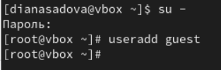

##

- Задайте пароль для пользователя guest (использую учётную запись администратора):

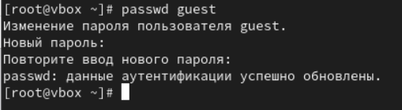

##

- Определите директорию, в которой вы находитесь, командой pwd. Сравните её с приглашением командной строки. Определите, является ли она вашей домашней директорией? Если нет, зайдите в домашнюю директорию.

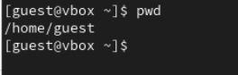

Да, мы находимся в домашней директорией.

##

- Уточните имя вашего пользователя командой whoami.

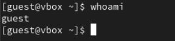

##

- Уточните имя вашего пользователя, его группу, а также группы, куда входит пользователь, командой id. Выведенные значения uid, gid и др. запомните. Сравните вывод id с выводом команды groups.

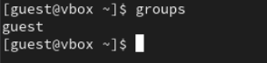

##

- Сравните полученную информацию об имени пользователя с данными, выводимыми в приглашении командной строки.

Информация полностью совпадает.

- Просмотрите файл /etc/passwd командой

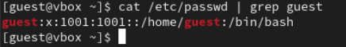

##

Найдите в нём свою учётную запись. Определите uid пользователя. Определите gid пользователя. Сравните найденные значения с полученными в предыдущих пунктах.

По мимо информации о группе, в которой на находится пользователь, у нас еще выводится информация о номере учетной записи в системе.

##

- Определите существующие в системе директории командой

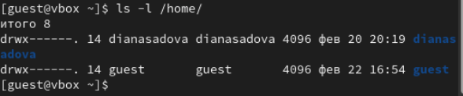

##

Удалось ли вам получить список поддиректорий директории /home? Какие права установлены на директориях?

Удалось получить список. Прова доступа (drwx------) только пользователь может как либо читать, редактировать и создавать документы 

##

- Проверьте, какие расширенные атрибуты установлены на поддиректориях, находящихся в директории /home, командой:

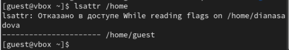

##

Удалось ли вам увидеть расширенные атрибуты директории?

Не удалось увидеть расширенные атрибуты директории. Отказано в доступе

Удалось ли вам увидеть расширенные атрибуты директорий других пользователей?

У нас в группе пока нет других пользователей.

##

- Создайте в домашней директории поддиректорию dir1 командой

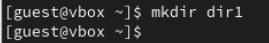

##

Определите командами ls -l и lsattr, какие права доступа и расши ренные атрибуты были выставлены на директорию dir1.

##

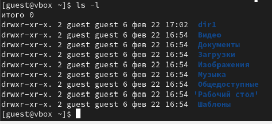

##

- Снимите с директории dir1 все атрибуты командой

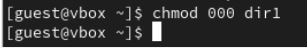

##

и проверьте с её помощью правильность выполнения команды

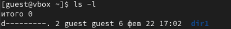

##

- Попытайтесь создать в директории dir1 файл file1 командой

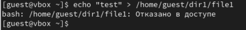

##

Объясните, почему вы получили отказ в выполнении операции по созданию файла?

У директории сняты все права доступа, мы не можем как либо читать, редактировать и создавать документы.

##

Оцените, как сообщение об ошибке отразилось на создании файла? Проверьте командой ls -l /home/guest/dir1 действительно ли файл file1 не находится внутри директории dir1.

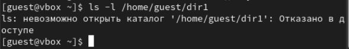

Он небыл создан, в директории dir1 его нет.

## Результаты

- В результате практической работы мы получили навыки работы в консоли с атрибутами файлов, закрепление теоретических основ дискреционного разграничения доступа в современных системах с открытым кодом на базе ОС Linux1.

