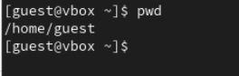
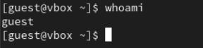
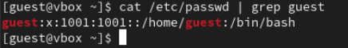
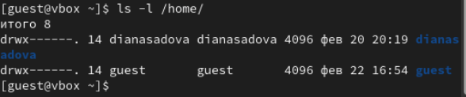
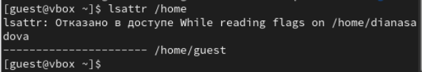
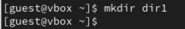
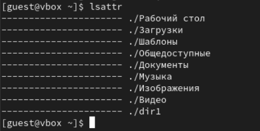
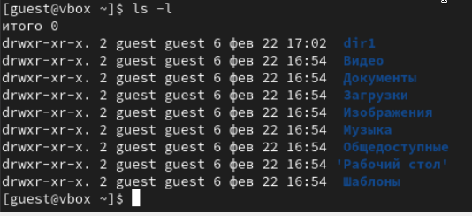
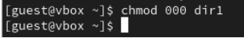
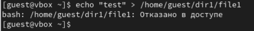

---
## Front matter
title: "Лабораторная работа № 2."
subtitle: "Дискреционное разграничение прав в Linux. Основные атрибуты"
author: "Диана Алексеевна Садова"

## Generic otions
lang: ru-RU
toc-title: "Содержание"

## Bibliography
bibliography: bib/cite.bib
csl: pandoc/csl/gost-r-7-0-5-2008-numeric.csl

## Pdf output format
toc: true # Table of contents
toc-depth: 2
lof: true # List of figures
lot: true # List of tables
fontsize: 12pt
linestretch: 1.5
papersize: a4
documentclass: scrreprt
## I18n polyglossia
polyglossia-lang:
  name: russian
  options:
	- spelling=modern
	- babelshorthands=true
polyglossia-otherlangs:
  name: english
## I18n babel
babel-lang: russian
babel-otherlangs: english
## Fonts
mainfont: PT Serif
romanfont: PT Serif
sansfont: PT Sans
monofont: PT Mono
mainfontoptions: Ligatures=TeX
romanfontoptions: Ligatures=TeX
sansfontoptions: Ligatures=TeX,Scale=MatchLowercase
monofontoptions: Scale=MatchLowercase,Scale=0.9
## Biblatex
biblatex: true
biblio-style: "gost-numeric"
biblatexoptions:
  - parentracker=true
  - backend=biber
  - hyperref=auto
  - language=auto
  - autolang=other*
  - citestyle=gost-numeric
## Pandoc-crossref LaTeX customization
figureTitle: "Рис."
tableTitle: "Таблица"
listingTitle: "Листинг"
lofTitle: "Список иллюстраций"
lotTitle: "Список таблиц"
lolTitle: "Листинги"
## Misc options
indent: true
header-includes:
  - \usepackage{indentfirst}
  - \usepackage{float} # keep figures where there are in the text
  - \floatplacement{figure}{H} # keep figures where there are in the text
---

# Цель работы

Получение практических навыков работы в консоли с атрибутами файлов, закрепление теоретических основ дискреционного разграничения доступа в современных системах с открытым кодом на базе ОС Linux1.

# Последовательность выполнения работы

Постарайтесь последовательно выполнить все пункты, занося ваши ответы на поставленные вопросы и замечания в отчёт.

1. В установленной при выполнении предыдущей лабораторной работы операционной системе создайте учётную запись пользователя guest (использую учётную запись администратора):(рис. [-@fig:001]).

{#fig:001 width=90%}

2. Задайте пароль для пользователя guest (использую учётную запись администратора):(рис. [-@fig:002]).

{#fig:002 width=90%}

3. Войдите в систему от имени пользователя guest.

4. Определите директорию, в которой вы находитесь, командой pwd. Сравните её с приглашением командной строки. Определите, является ли она вашей домашней директорией? Если нет, зайдите в домашнюю директорию.(рис. [-@fig:003]).

{#fig:003 width=90%}

Да, мы находимся в домашней директорией.

5. Уточните имя вашего пользователя командой whoami.(рис. [-@fig:004]).

{#fig:004 width=90%}

6. Уточните имя вашего пользователя, его группу, а также группы, куда входит пользователь, командой id. Выведенные значения uid, gid и др. запомните. Сравните вывод id с выводом команды groups.(рис. [-@fig:005]).

{#fig:005 width=90%}

7. Сравните полученную информацию об имени пользователя с данными, выводимыми в приглашении командной строки.

Информация полностью совпадает.

8. Просмотрите файл /etc/passwd командой(рис. [-@fig:006]).

{#fig:006 width=90%}

Найдите в нём свою учётную запись. Определите uid пользователя. Определите gid пользователя. Сравните найденные значения с полученными в предыдущих пунктах.

По мимо информации о группе, в которой на находится пользователь, у нас еще выводится информация о номере учетной записи в системе.

9. Определите существующие в системе директории командой(рис. [-@fig:007]).

{#fig:007 width=90%}

Удалось ли вам получить список поддиректорий директории /home? Какие права установлены на директориях?

Удалось получить список. Прова доступа (drwx------) только пользователь может как либо читать, редактировать и создавать документы 

10. Проверьте, какие расширенные атрибуты установлены на поддиректориях, находящихся в директории /home, командой:(рис. [-@fig:008]).

{#fig:008 width=90%}

Удалось ли вам увидеть расширенные атрибуты директории?

Не удалось увидеть расширенные атрибуты директории. Отказано в доступе

Удалось ли вам увидеть расширенные атрибуты директорий других пользователей?

У нас в группе пока нет других пользователей.

11. Создайте в домашней директории поддиректорию dir1 командой(рис. [-@fig:009]).

{#fig:009 width=90%}

Определите командами ls -l и lsattr, какие права доступа и расши ренные атрибуты были выставлены на директорию dir1.(рис. [-@fig:010]),(рис. [-@fig:011]).

{#fig:011 width=90%}

{#fig:010 width=90%}

12. Снимите с директории dir1 все атрибуты командой(рис. [-@fig:012]).

{#fig:012 width=90%}

и проверьте с её помощью правильность выполнения команды(рис. [-@fig:013]).

{#fig:013 width=90%}

13. Попытайтесь создать в директории dir1 файл file1 командой(рис. [-@fig:014]).

{#fig:014 width=90%}

Объясните, почему вы получили отказ в выполнении операции по созданию файла?

У директории сняты все права доступа, мы не можем как либо читать, редактировать и создавать документы.

Оцените, как сообщение об ошибке отразилось на создании файла? Проверьте командой ls -l /home/guest/dir1 действительно ли файл file1 не находится внутри директории dir1.(рис. [-@fig:015]).

{#fig:015 width=90%}

Он небыл создан, в директории dir1 его нет.

14. Заполните таблицу «Установленные права и разрешённые действия» (см. табл. 2.1), выполняя действия от имени владельца директории (файлов), определив опытным путём, какие операции разрешены, а какие нет. Если операция разрешена, занесите в таблицу знак «+», если не разрешена, знак «-».

: Права на каталог и файл в нем {#tbl:std-dir}

| Права директории | Права файла | Создание файла | Удаление файла | Запись в файл | Чтение файла | Смена директории | Просмотр файлов в директории | Переименование файла | Смена атрибутов файла |
|----------|----------|----------|----------|----------|----------|----------|----------|----------|
| 000    | 000  | -   | -    | -   | -   | -    | -   | -   | -   |
| 100    | 000  | -   | -    | -   | -   | +    | -   | -   | -   |
| 200    | 000  | +   | +    | -   | -   | -    | -   | +   | -   |
| 300    | 000  | +   | +    | -   | -   | +    | -   | +   | -   |
| 400    | 000  | -   | -    | -   | -   | +    | -   | -   | -   |
| 500    | 000  | +   | +    | -   | -   | +    | -   | +   | -   |
| 600    | 000  | +   | +    | -   | -   | -    | +   | +   | -   |
| 700    | 000  | +   | +    | -   | -   | +    | +   | -   | -   |
| 100    | 200  | -   | -    | +   | -   | +    | -   | -   | -   |
| 200    | 200  | +   | +    | +   | -   | -    | -   | +   | -   |
| 300    | 200  | +   | +    | +   | -   | +    | -   | +   | -   |
| 400    | 200  | -   | -    | +   | -   | +    | +   | -   | +   |
| 500    | 200  | +   | +    | +   | -   | -    | +   | -   | +   |
| 600    | 200  | +   | +    | +   | -   | -    | +   | +   | +   |
| 700    | 200  | +   | +    | +   | -   | +    | +   | +   | +   |
| 100    | 400  | -   | -    | -   | -   | +    | -   | -   | -   |
| 200    | 400  | +   | +    | -   | -   | -    | -   | +   | -   |
| 300    | 400  | +   | +    | -   | -   | +    | -   | +   | -   |
| 400    | 400  | -   | -    | -   | +   | +    | -   | -   | -   |
| 500    | 400  | +   | +    | -   | +   | +    | -   | +   | -   |
| 600    | 400  | +   | +    | -   | +   | -    | +   | +   | -   |
| 700    | 400  | +   | +    | -   | +   | +    | +   | -   | -   |
| 100    | 700  | -   | -    | -   | -   | +    | -   | -   | -   |
| 200    | 700  | +   | +    | +   | +   | -    | -   | +   | -   |
| 300    | 700  | +   | +    | +   | +   | +    | -   | +   | -   |
| 400    | 700  | -   | -    | +   | +   | +    | -   | -   | -   |
| 500    | 700  | -   | -    | +   | +   | +    | +   | -   | +   |
| 600    | 700  | +   | +    | +   | -   | +    | +   | +   | +   |
| 700    | 700  | +   | +    | +   | +   | +    | +   | +   | +   |

# Выводы

В результате практической работы мы получили навыки работы в консоли с атрибутами файлов, закрепление теоретических основ дискреционного разграничения доступа в современных системах с открытым кодом на базе ОС Linux1.

# Список литературы{.unnumbered}

::: {#refs}
:::
