---
## Front matter
lang: ru-RU
title: Лабораторная работа № 3
subtitle: Дискреционное разграничение прав в Linux. Два пользователя
author:
  - Cадова Д. А.
institute:
  - Российский университет дружбы народов, Москва, Россия

## i18n babel
babel-lang: russian
babel-otherlangs: english
## Fonts
mainfont: PT Serif
romanfont: PT Serif
sansfont: PT Sans
monofont: PT Mono
mainfontoptions: Ligatures=TeX
romanfontoptions: Ligatures=TeX
sansfontoptions: Ligatures=TeX,Scale=MatchLowercase
monofontoptions: Scale=MatchLowercase,Scale=0.9

## Formatting pdf
toc: false
toc-title: Содержание
slide_level: 2
aspectratio: 169
section-titles: true
theme: metropolis
header-includes:
 - \metroset{progressbar=frametitle,sectionpage=progressbar,numbering=fraction}
 - '\makeatletter'
 - '\beamer@ignorenonframefalse'
 - '\makeatother'
---

# Информация

## Докладчик

:::::::::::::: {.columns align=center}
::: {.column width="70%"}

  * Садова Диана Алексеевна
  * студент бакалавриата
  * Российский университет дружбы народов
  * [113229118@pfur.ru]
  * <https://DianaSadova.github.io/ru/>

:::
::::::::::::::

# Вводная часть

## Актуальность

- Узнать и научится как работать в консоли с двумя пользователями, разобрать права для групп данных пользователей.

## Цели и задачи

- Получение практических навыков работы в консоли с атрибутами файлов для групп пользователей.

## Материалы и методы

- Текст лабороторной работы № 3 
- Опыт прошлого года 

## Содержание исследования

- В установленной операционной системе создайте учётную запись пользователя guest2 (использую учётную запись администратора):

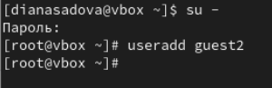

##

- Задайте пароль для пользователя guest2 (использую учётную запись администратора):

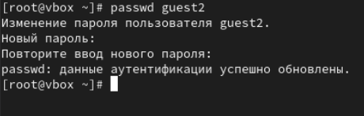

##

- Добавьте пользователя guest2 в группу guest:

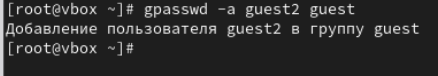

##

- Осуществите вход в систему от двух пользователей на двух разных консолях: guest на первой консоли и guest2 на второй консоли.

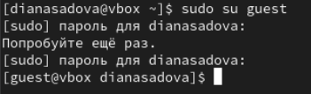

##

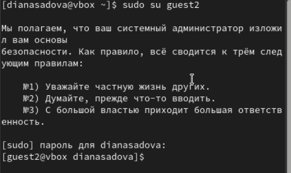

##

- Для обоих пользователей командой pwd определите директорию, в которой вы находитесь. Сравните её с приглашениями командной строки.

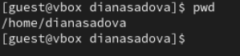

##

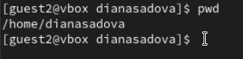

Домашнии директории полностью совпадают.

##

- Уточните имя вашего пользователя, его группу, кто входит в неё и к каким группам принадлежит он сам. 

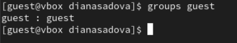

##

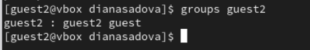

##

Определите командами groups guest и groups guest2, в какие группы входят пользователи guest и guest2.

Пользователь guest является единственным в всоей группе.

Пользователь guest2 входит в одну группу с guest.
 
##

- Сравните вывод команды groups с выводом команд id -Gn и id -G.

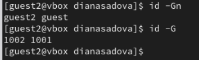

##

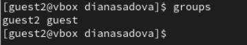

##

- Сравните полученную информацию с содержимым файла /etc/group. Просмотрите файл командой

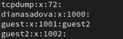

##

- От имени пользователя guest2 выполните регистрацию пользователя guest2 в группе guest командой

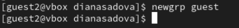

##

- От имени пользователя guest измените права директории /home/guest, разрешив все действия для пользователей группы:

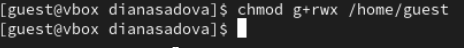

##

- От имени пользователя guest снимите с директории /home/guest/dir1 все атрибуты командой и проверьте правильность снятия атрибутов.

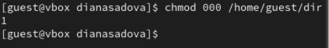

## Результаты

- Мы приобрели практические навыки работы в консоли с атрибутами файлов для групп пользователей.

