---
## Front matter
title: "Лабораторная работа № 3."
subtitle: "Дискреционное разграничение прав в Linux. Два пользователя"
author: "Диана Алексеевна Садова"

## Generic otions
lang: ru-RU
toc-title: "Содержание"

## Bibliography
bibliography: bib/cite.bib
csl: pandoc/csl/gost-r-7-0-5-2008-numeric.csl

## Pdf output format
toc: true # Table of contents
toc-depth: 2
lof: true # List of figures
lot: true # List of tables
fontsize: 12pt
linestretch: 1.5
papersize: a4
documentclass: scrreprt
## I18n polyglossia
polyglossia-lang:
  name: russian
  options:
	- spelling=modern
	- babelshorthands=true
polyglossia-otherlangs:
  name: english
## I18n babel
babel-lang: russian
babel-otherlangs: english
## Fonts
mainfont: PT Serif
romanfont: PT Serif
sansfont: PT Sans
monofont: PT Mono
mainfontoptions: Ligatures=TeX
romanfontoptions: Ligatures=TeX
sansfontoptions: Ligatures=TeX,Scale=MatchLowercase
monofontoptions: Scale=MatchLowercase,Scale=0.9
## Biblatex
biblatex: true
biblio-style: "gost-numeric"
biblatexoptions:
  - parentracker=true
  - backend=biber
  - hyperref=auto
  - language=auto
  - autolang=other*
  - citestyle=gost-numeric
## Pandoc-crossref LaTeX customization
figureTitle: "Рис."
tableTitle: "Таблица"
listingTitle: "Листинг"
lofTitle: "Список иллюстраций"
lotTitle: "Список таблиц"
lolTitle: "Листинги"
## Misc options
indent: true
header-includes:
  - \usepackage{indentfirst}
  - \usepackage{float} # keep figures where there are in the text
  - \floatplacement{figure}{H} # keep figures where there are in the text
---

# Цель работы

Получение практических навыков работы в консоли с атрибутами файлов для групп пользователей.

# Порядок выполнения работы

1. В установленной операционной системе создайте учётную запись пользователя guest2 (использую учётную запись администратора):(рис. [-@fig:001]).

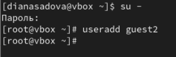{#fig:001 width=90%}

2. Задайте пароль для пользователя guest2 (использую учётную запись администратора):(рис. [-@fig:002]).

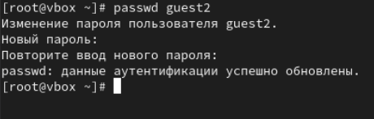{#fig:002 width=90%}

3. Добавьте пользователя guest2 в группу guest:(рис. [-@fig:003]).

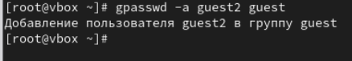{#fig:003 width=90%}

4. Осуществите вход в систему от двух пользователей на двух разных консолях: guest на первой консоли и guest2 на второй консоли.(рис. [-@fig:004]),(рис. [-@fig:005]).

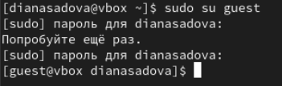{#fig:004 width=90%}

{#fig:005 width=90%}

5. Для обоих пользователей командой pwd определите директорию, в которой вы находитесь. Сравните её с приглашениями командной строки.(рис. [-@fig:006]),(рис. [-@fig:007]).

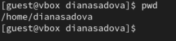{#fig:006 width=90%}

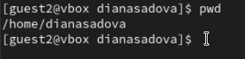{#fig:007 width=90%}

Домашнии директории полностью совпадают.

6. Уточните имя вашего пользователя, его группу, кто входит в неё и к каким группам принадлежит он сам. (рис. [-@fig:008]),(рис. [-@fig:009]).

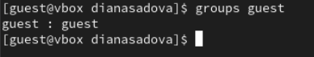{#fig:008 width=90%}

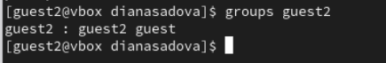{#fig:009 width=90%}

Определите командами groups guest и groups guest2, в какие группы входят пользователи guest и guest2.

Пользователь guest является единственным в всоей группе.

Пользователь guest2 входит в одну группу с guest.
 
Сравните вывод команды groups с выводом команд id -Gn и id -G.(рис. [-@fig:011]),(рис. [-@fig:012]).

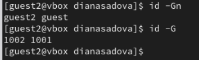{#fig:011 width=90%}

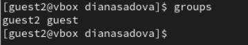{#fig:012 width=90%}

7. Сравните полученную информацию с содержимым файла /etc/group. Просмотрите файл командой(рис. [-@fig:013]).

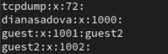{#fig:013 width=90%}

8. От имени пользователя guest2 выполните регистрацию пользователя guest2 в группе guest командой(рис. [-@fig:014]).

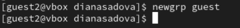{#fig:014 width=90%}

9. От имени пользователя guest измените права директории /home/guest, разрешив все действия для пользователей группы:(рис. [-@fig:017]).

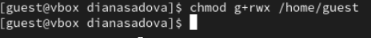{#fig:017 width=90%}

10. От имени пользователя guest снимите с директории /home/guest/dir1 все атрибуты командой и проверьте правильность снятия атрибутов.(рис. [-@fig:018]).

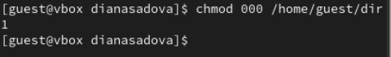{#fig:018 width=90%}

Меняя атрибуты у директории dir1 и файла file1 от имени пользователя guest и делая проверку от пользователя guest2, заполните табл. 3.1, определив опытным путём, какие операции разрешены, а какие нет. Если операция разрешена, занесите в таблицу знак «+», если не разрешена, знак «-».

: Права на каталог и файл в нем {#tbl:std-dir}

| Права директории | Права файла | Создание файла | Удаление файла | Запись в файл | Чтение файла | Смена директории | Просмотр файлов в директории | Переименование файла | Смена атрибутов файла |
|----------|----------|----------|----------|----------|----------|----------|----------|----------|
| 000    | 000  | -   | -    | -   | -   | -    | -   | -   | -   |
| 010    | 000  | -   | -    | -   | -   | +    | -   | -   | -   |
| 020    | 000  | +   | +    | -   | -   | -    | -   | +   | -   |
| 030    | 000  | +   | +    | -   | -   | +    | -   | +   | -   |
| 040    | 000  | -   | -    | -   | -   | +    | -   | -   | -   |
| 050    | 000  | +   | +    | -   | -   | +    | -   | +   | -   |
| 060    | 000  | +   | +    | -   | -   | -    | +   | +   | -   |
| 070    | 000  | +   | +    | -   | -   | +    | +   | -   | -   |
| 010    | 020  | -   | -    | +   | -   | +    | -   | -   | -   |
| 020    | 020  | +   | +    | +   | -   | -    | -   | +   | -   |
| 030    | 020  | +   | +    | +   | -   | +    | -   | +   | -   |
| 040    | 020  | -   | -    | +   | -   | +    | +   | -   | +   |
| 050    | 020  | +   | +    | +   | -   | -    | +   | -   | +   |
| 060    | 020  | +   | +    | +   | -   | -    | +   | +   | +   |
| 070    | 020  | +   | +    | +   | -   | +    | +   | +   | +   |
| 010    | 040  | -   | -    | -   | -   | +    | -   | -   | -   |
| 020    | 040  | +   | +    | -   | -   | -    | -   | +   | -   |
| 030    | 040  | +   | +    | -   | -   | +    | -   | +   | -   |
| 040    | 040  | -   | -    | -   | +   | +    | -   | -   | -   |
| 050    | 040  | +   | +    | -   | +   | +    | -   | +   | -   |
| 060    | 040  | +   | +    | -   | +   | -    | +   | +   | -   |
| 070    | 040  | +   | +    | -   | +   | +    | +   | -   | -   |
| 010    | 070  | -   | -    | -   | -   | +    | -   | -   | -   |
| 020    | 070  | +   | +    | +   | +   | -    | -   | +   | -   |
| 030    | 070  | +   | +    | +   | +   | +    | -   | +   | -   |
| 040    | 070  | -   | -    | +   | +   | +    | -   | -   | -   |
| 050    | 070  | -   | -    | +   | +   | +    | +   | -   | +   |
| 060    | 070  | +   | +    | +   | -   | +    | +   | +   | +   |
| 070    | 070  | +   | +    | +   | +   | +    | +   | +   | +   |

# Выводы

Мы приобрели практические навыки работы в консоли с атрибутами файлов для групп пользователей.

# Список литературы{.unnumbered}

::: {#refs}
:::
