---
## Front matter
lang: ru-RU
title: Лабораторная работа № 4
subtitle: Дискреционное разграничение прав в Linux. Расширенные атрибуты
author:
  - Cадова Д. А.
institute:
  - Российский университет дружбы народов, Москва, Россия

## i18n babel
babel-lang: russian
babel-otherlangs: english
## Fonts
mainfont: PT Serif
romanfont: PT Serif
sansfont: PT Sans
monofont: PT Mono
mainfontoptions: Ligatures=TeX
romanfontoptions: Ligatures=TeX
sansfontoptions: Ligatures=TeX,Scale=MatchLowercase
monofontoptions: Scale=MatchLowercase,Scale=0.9

## Formatting pdf
toc: false
toc-title: Содержание
slide_level: 2
aspectratio: 169
section-titles: true
theme: metropolis
header-includes:
 - \metroset{progressbar=frametitle,sectionpage=progressbar,numbering=fraction}
 - '\makeatletter'
 - '\beamer@ignorenonframefalse'
 - '\makeatother'
---

# Информация

## Докладчик

:::::::::::::: {.columns align=center}
::: {.column width="70%"}

  * Садова Диана Алексеевна
  * студент бакалавриата
  * Российский университет дружбы народов
  * [113229118@pfur.ru]
  * <https://DianaSadova.github.io/ru/>

:::
::::::::::::::

# Вводная часть

## Актуальность

- Очень важно понимать и уметь работать с атрибутами и правами как файла, так и пользователя.

## Цели и задачи

- Получение практических навыков работы в консоли с расширенными атрибутами файлов 

## Материалы и методы

- Текст лабороторной работы № 4

## Содержание исследования

- От имени пользователя guest определите расширенные атрибуты файла /home/guest/dir1/file1 командой

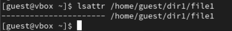

##

- Установите командой на файл file1 права, разрешающие чтение и запись для владельца файла.

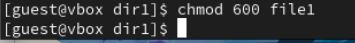

##

- Попробуйте установить на файл /home/guest/dir1/file1 расширенный атрибут a от имени пользователя guest:

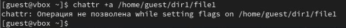

##

- Зайдите на третью консоль с правами администратора либо повысьте свои права с помощью команды su. Попробуйте установить расширенный атрибут a на файл /home/guest/dir1/file1 от имени суперпользователя:

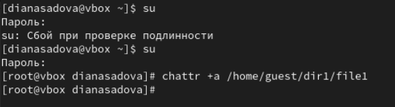

##

- От пользователя guest проверьте правильность установления атрибута:

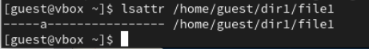

##

- Выполните дозапись в файл file1 слова «test» командой

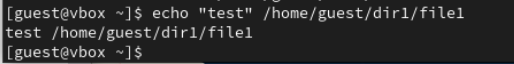

##

- После этого выполните чтение файла file1 командой

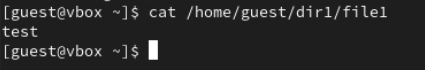

##

- Попробуйте удалить файл file1 либо стереть имеющуюся в нём информацию командой

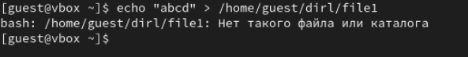

##

- Попробуйте переименовать файл.

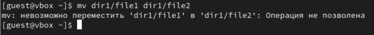

##

- Попробуйте с помощью команды chmod 000 file1 установить на файл file1 права, например, запрещающие чтение и запись для владельца файла. Удалось ли вам успешно выполнить указанные команды?

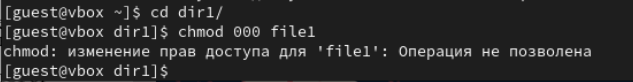

##

- Снимите расширенный атрибут a с файла /home/guest/dirl/file1 от имени суперпользователя командой

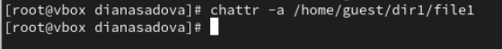

##

Повторите операции, которые вам ранее не удавалось выполнить. Ваши наблюдения занесите в отчёт.

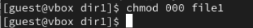

##

- Повторите ваши действия по шагам, заменив атрибут «a» атрибутом «i».

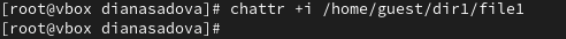

##

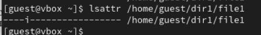

##

Удалось ли вам дозаписать информацию в файл? Ваши наблюдения занесите в отчёт.

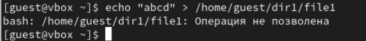

##

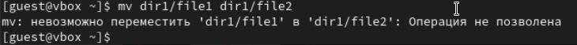

## Результаты

- В результате выполнения работы вы повысили свои навыки использования интерфейса командой строки (CLI), познакомились на примерах с тем, как используются основные и расширенные атрибуты при разграничении доступа. Имели возможность связать теорию дискреционного разделения доступа (дискреционная политика безопасности) с её реализацией на практике в ОС Linux. 

