---
## Front matter
title: "Лабораторная работа № 4."
subtitle: "Дискреционное разграничение прав в Linux. Расширенные атрибуты"
author: "Диана Алексеевна Садова"

## Generic otions
lang: ru-RU
toc-title: "Содержание"

## Bibliography
bibliography: bib/cite.bib
csl: pandoc/csl/gost-r-7-0-5-2008-numeric.csl

## Pdf output format
toc: true # Table of contents
toc-depth: 2
lof: true # List of figures
lot: true # List of tables
fontsize: 12pt
linestretch: 1.5
papersize: a4
documentclass: scrreprt
## I18n polyglossia
polyglossia-lang:
  name: russian
  options:
	- spelling=modern
	- babelshorthands=true
polyglossia-otherlangs:
  name: english
## I18n babel
babel-lang: russian
babel-otherlangs: english
## Fonts
mainfont: PT Serif
romanfont: PT Serif
sansfont: PT Sans
monofont: PT Mono
mainfontoptions: Ligatures=TeX
romanfontoptions: Ligatures=TeX
sansfontoptions: Ligatures=TeX,Scale=MatchLowercase
monofontoptions: Scale=MatchLowercase,Scale=0.9
## Biblatex
biblatex: true
biblio-style: "gost-numeric"
biblatexoptions:
  - parentracker=true
  - backend=biber
  - hyperref=auto
  - language=auto
  - autolang=other*
  - citestyle=gost-numeric
## Pandoc-crossref LaTeX customization
figureTitle: "Рис."
tableTitle: "Таблица"
listingTitle: "Листинг"
lofTitle: "Список иллюстраций"
lotTitle: "Список таблиц"
lolTitle: "Листинги"
## Misc options
indent: true
header-includes:
  - \usepackage{indentfirst}
  - \usepackage{float} # keep figures where there are in the text
  - \floatplacement{figure}{H} # keep figures where there are in the text
---

# Цель работы

Получение практических навыков работы в консоли с расширенными атрибутами файлов

# Последовательность выполнения работы

1. От имени пользователя guest определите расширенные атрибуты файла /home/guest/dir1/file1 командой(рис. [-@fig:001]).

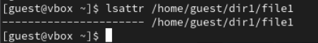{#fig:001 width=90%}

2. Установите командой на файл file1 права, разрешающие чтение и запись для владельца файла.(рис. [-@fig:002]).

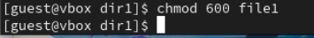{#fig:002 width=90%}

3. Попробуйте установить на файл /home/guest/dir1/file1 расширенный атрибут a от имени пользователя guest:(рис. [-@fig:003]).

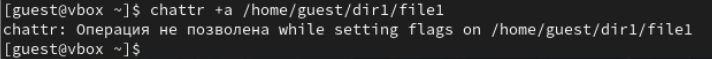{#fig:003 width=90%}

В ответ вы должны получить отказ от выполнения операции.

Да, так и произошло.

4. Зайдите на третью консоль с правами администратора либо повысьте свои права с помощью команды su. Попробуйте установить расширенный атрибут a на файл /home/guest/dir1/file1 от имени суперпользователя:(рис. [-@fig:004]).

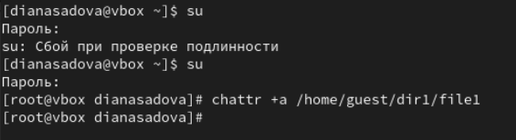{#fig:004 width=90%}

5. От пользователя guest проверьте правильность установления атрибута:(рис. [-@fig:005]).

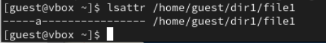{#fig:005 width=90%}

6. Выполните дозапись в файл file1 слова «test» командой(рис. [-@fig:006]).

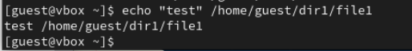{#fig:006 width=90%}

После этого выполните чтение файла file1 командой(рис. [-@fig:007]).

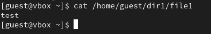{#fig:007 width=90%}

Убедитесь, что слово test было успешно записано в file1.

7. Попробуйте удалить файл file1 либо стереть имеющуюся в нём информацию командой(рис. [-@fig:008]).

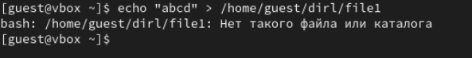{#fig:008 width=90%}

Попробуйте переименовать файл.(рис. [-@fig:010]).

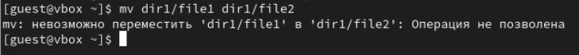{#fig:010 width=90%}

8. Попробуйте с помощью команды chmod 000 file1 установить на файл file1 права, например, запрещающие чтение и запись для владельца файла. Удалось ли вам успешно выполнить указанные команды?(рис. [-@fig:011]).

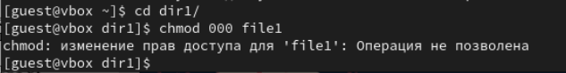{#fig:011 width=90%}

Нет, операция не была выполнена.

9. Снимите расширенный атрибут a с файла /home/guest/dirl/file1 от имени суперпользователя командой(рис. [-@fig:012]).

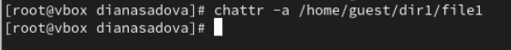{#fig:012 width=90%}

Повторите операции, которые вам ранее не удавалось выполнить. Ваши наблюдения занесите в отчёт.(рис. [-@fig:013])

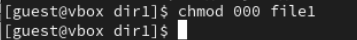{#fig:013 width=90%}

После снятия атрибут a с файла получилось успешно изменить права доступа.

10. Повторите ваши действия по шагам, заменив атрибут «a» атрибутом «i».(рис. [-@fig:014]),(рис. [-@fig:015]).

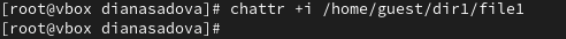{#fig:014 width=90%}

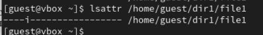{#fig:015 width=90%}

Удалось ли вам дозаписать информацию в файл? Ваши наблюдения занесите в отчёт. (рис. [-@fig:016]),(рис. [-@fig:017]).

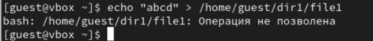{#fig:016 width=90%}

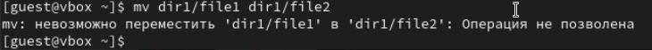{#fig:017 width=90%}

Все действия были заблокированны.

# Выводы

В результате выполнения работы вы повысили свои навыки использования интерфейса командой строки (CLI), познакомились на примерах с тем, как используются основные и расширенные атрибуты при разграничении доступа. Имели возможность связать теорию дискреционного разделения доступа (дискреционная политика безопасности) с её реализацией на прак- тике в ОС Linux.

# Список литературы{.unnumbered}

::: {#refs}
:::
