---
## Front matter
lang: ru-RU
title: Лабораторная работа № 5
subtitle: Дискреционное разграничение прав в Linux. Исследование влияния дополнительных атрибутов
author:
  - Cадова Д. А.
institute:
  - Российский университет дружбы народов, Москва, Россия

## i18n babel
babel-lang: russian
babel-otherlangs: english
## Fonts
mainfont: PT Serif
romanfont: PT Serif
sansfont: PT Sans
monofont: PT Mono
mainfontoptions: Ligatures=TeX
romanfontoptions: Ligatures=TeX
sansfontoptions: Ligatures=TeX,Scale=MatchLowercase
monofontoptions: Scale=MatchLowercase,Scale=0.9

## Formatting pdf
toc: false
toc-title: Содержание
slide_level: 2
aspectratio: 169
section-titles: true
theme: metropolis
header-includes:
 - \metroset{progressbar=frametitle,sectionpage=progressbar,numbering=fraction}
 - '\makeatletter'
 - '\beamer@ignorenonframefalse'
 - '\makeatother'
---

# Информация

## Докладчик

:::::::::::::: {.columns align=center}
::: {.column width="70%"}

  * Садова Диана Алексеевна
  * студент бакалавриата
  * Российский университет дружбы народов
  * [113229118@pfur.ru]
  * <https://DianaSadova.github.io/ru/>

:::
::::::::::::::

# Вводная часть

## Актуальность

- Нам важно понимаит как изменяется индификаторы, и SetUID- , Sticky-битов. Так же, нужно отрабатывать навыки работы в консоли с дополнительными атрибутами

## Цели и задачи

- Изучение механизмов изменения идентификаторов, применения SetUID- и Sticky-битов. Получение практических навыков работы в консоли с дополнительными атрибутами. Рассмотрение работы механизма смены идентификатора процессов пользователей, а также влияние бита Sticky на запись и удаление файлов 

## Материалы и методы

- Текст лабороторной работы № 5

## Содержание исследования

### Создание программы

1. Войдите в систему от имени пользователя guest.

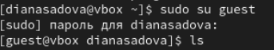

##

2. Создайте программу simpleid.c:

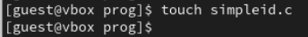

##

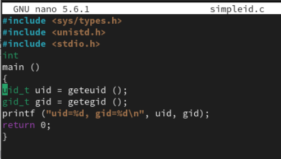

##

3. Скомплилируйте программу и убедитесь, что файл программы создан:

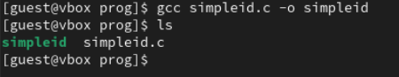

##

4. Выполните программу simpleid:

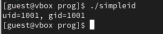

##

5. Выполните системную программу id:

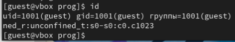

##

и сравните полученный вами результат с данными предыдущего пункта задания.

Записи идентичны.

##

6. Усложните программу, добавив вывод действительных идентификаторов:

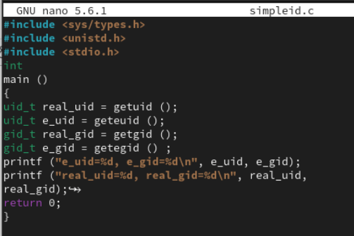

##

7. Скомпилируйте и запустите simpleid2.c:

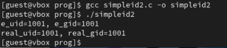

##

8. От имени суперпользователя выполните команды:

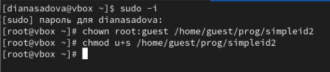

##

9. Используйте sudo или повысьте временно свои права с помощью su.

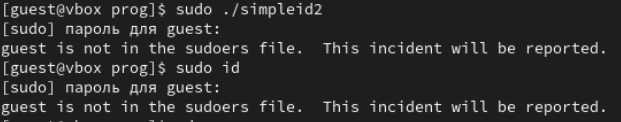

##

Поясните, что делают эти команды.

Мы пытаемся запустить код в файле simpleid2.c от имени суперпользователя.

##

10. Выполните проверку правильности установки новых атрибутов и смены владельца файла simpleid2:

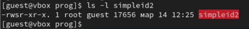

##

11. Запустите simpleid2 и id:

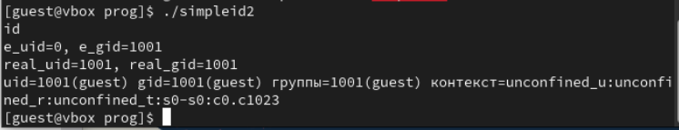

##

Сравните результаты.

simpleid2 - выдает только информацию о id (номер).

id - дает больше информации об пользователе и его группах.

##

12. Проделайте тоже самое относительно SetGID-бита.

13. Создайте программу readfile.c:

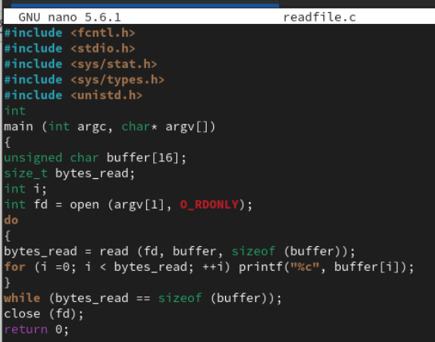

##

14. Откомпилируйте её.

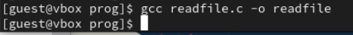

##

15. Смените владельца у файла readfile.c (или любого другого текстового файла в системе) и измените права так, чтобы только суперпользователь (root) мог прочитать его, a guest не мог.

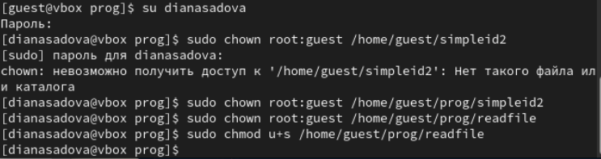

##

16. Проверьте, что пользователь guest не может прочитать файл readfile.c.

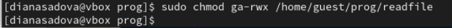

##

17. Смените у программы readfile владельца и установите SetU’D-бит..

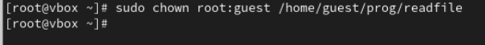

##

18. Проверьте, может ли программа readfile прочитать файл readfile.c?

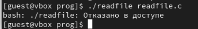

##

19. Проверьте, может ли программа readfile прочитать файл /etc/shadow?

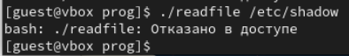

### Исследование Sticky-бита

1. Выясните, установлен ли атрибут Sticky на директории /tmp, для чего выполните команду

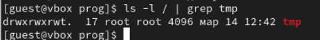

##

2. От имени пользователя guest создайте файл file01.txt в директории /tmp со словом test:

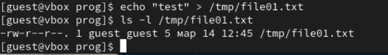

##

3. Просмотрите атрибуты у только что созданного файла и разрешите чтение и запись для категории пользователей «все остальные»:

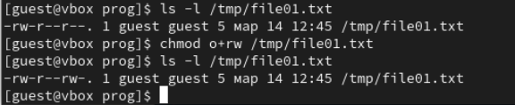

##

4. От пользователя guest2 (не являющегося владельцем) попробуйте прочитать файл /tmp/file01.txt:

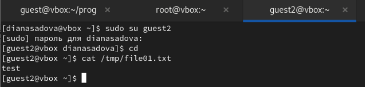

##

5. От пользователя guest2 попробуйте дозаписать в файл /tmp/file01.txt слово test2 командой

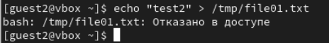

##

Удалось ли вам выполнить операцию?

Нет. Отказано в доступе.

##

6. Проверьте содержимое файла командой

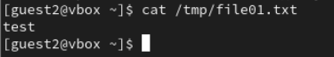

##

7. От пользователя guest2 попробуйте записать в файл /tmp/file01.txt слово test3, стерев при этом всю имеющуюся в файле информацию командой

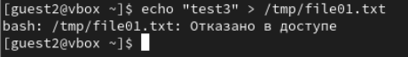

##

Удалось ли вам выполнить операцию?

Нет. Отказано в доступе.

##

8. Проверьте содержимое файла командой

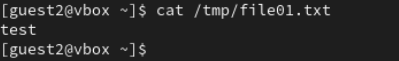

##

9. От пользователя guest2 попробуйте удалить файл /tmp/file01.txt командой

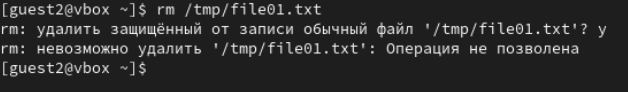

##

Удалось ли вам удалить файл?

Нет. Отказано в доступе.

##

10. Повысьте свои права до суперпользователя следующей командой su - и выполните после этого команду, снимающую атрибут t (Sticky-бит) с директории /tmp:

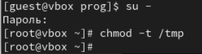

##

11. Покиньте режим суперпользователя командой

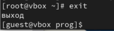

##

12. От пользователя guest2 проверьте, что атрибута t у директории /tmp нет:

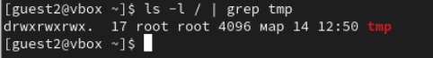

##

13. Повторите предыдущие шаги. Какие наблюдаются изменения?

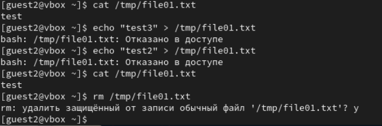

##

14. Удалось ли вам удалить файл от имени пользователя, не являющегося его владельцем? Ваши наблюдения занесите в отчёт.

Да, мы смогли удалить файл

##

15. Повысьте свои права до суперпользователя и верните атрибут t на директорию /tmp:

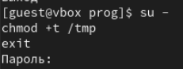

## Результаты

- Изучили механиз изменения идентификаторов, применения SetUID- и Sticky-битов. 

- Получили практические навыки работы в консоли с дополнительными атрибутами. 

- Рассмотрели работы механизма смены идентификатора процессов пользователей, а также влияние бита Sticky на запись и удаление файлов

