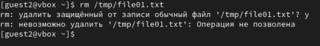

---
## Front matter
title: "Лабораторная работа № 5."
subtitle: "Дискреционное разграничение прав в Linux. Исследование влияния дополнительных атрибутов"
author: "Диана Алексеевна Садова"

## Generic otions
lang: ru-RU
toc-title: "Содержание"

## Bibliography
bibliography: bib/cite.bib
csl: pandoc/csl/gost-r-7-0-5-2008-numeric.csl

## Pdf output format
toc: true # Table of contents
toc-depth: 2
lof: true # List of figures
lot: true # List of tables
fontsize: 12pt
linestretch: 1.5
papersize: a4
documentclass: scrreprt
## I18n polyglossia
polyglossia-lang:
  name: russian
  options:
	- spelling=modern
	- babelshorthands=true
polyglossia-otherlangs:
  name: english
## I18n babel
babel-lang: russian
babel-otherlangs: english
## Fonts
mainfont: PT Serif
romanfont: PT Serif
sansfont: PT Sans
monofont: PT Mono
mainfontoptions: Ligatures=TeX
romanfontoptions: Ligatures=TeX
sansfontoptions: Ligatures=TeX,Scale=MatchLowercase
monofontoptions: Scale=MatchLowercase,Scale=0.9
## Biblatex
biblatex: true
biblio-style: "gost-numeric"
biblatexoptions:
  - parentracker=true
  - backend=biber
  - hyperref=auto
  - language=auto
  - autolang=other*
  - citestyle=gost-numeric
## Pandoc-crossref LaTeX customization
figureTitle: "Рис."
tableTitle: "Таблица"
listingTitle: "Листинг"
lofTitle: "Список иллюстраций"
lotTitle: "Список таблиц"
lolTitle: "Листинги"
## Misc options
indent: true
header-includes:
  - \usepackage{indentfirst}
  - \usepackage{float} # keep figures where there are in the text
  - \floatplacement{figure}{H} # keep figures where there are in the text
---

# Цель работы

Изучение механизмов изменения идентификаторов, применения SetUID- и Sticky-битов. Получение практических навыков работы в консоли с дополнительными атрибутами. Рассмотрение работы механизма смены идентификатора процессов пользователей, а также влияние бита Sticky на запись и удаление файлов

# Последовательность выполнения работы

## Создание программы

1. Войдите в систему от имени пользователя guest.(рис. [-@fig:001]).

{#fig:001 width=90%}

2. Создайте программу simpleid.c:(рис. [-@fig:002]),(рис. [-@fig:003]).

{#fig:002 width=90%}

{#fig:003 width=90%}

3. Скомплилируйте программу и убедитесь, что файл программы создан:(рис. [-@fig:004]).

{#fig:004 width=90%}

4. Выполните программу simpleid:(рис. [-@fig:005]).

{#fig:005 width=90%}

5. Выполните системную программу id:(рис. [-@fig:006]).

{#fig:006 width=90%}

и сравните полученный вами результат с данными предыдущего пункта задания.

Записи идентичны.

6. Усложните программу, добавив вывод действительных идентификаторов:(рис. [-@fig:007]).

{#fig:007 width=90%}

Получившуюся программу назовите simpleid2.c.

7. Скомпилируйте и запустите simpleid2.c:(рис. [-@fig:008]).

{#fig:008 width=90%}

8. От имени суперпользователя выполните команды:(рис. [-@fig:009]).

{#fig:009 width=90%}

9. Используйте sudo или повысьте временно свои права с помощью su.(рис. [-@fig:010]).

{#fig:010 width=90%}

Поясните, что делают эти команды.

Мы пытаемся запустить код в файле simpleid2.c от имени суперпользователя.

10. Выполните проверку правильности установки новых атрибутов и смены владельца файла simpleid2:(рис. [-@fig:011]).

{#fig:011 width=90%}

11. Запустите simpleid2 и id:(рис. [-@fig:013]).

{#fig:013 width=90%}

Сравните результаты.

simpleid2 - выдает только информацию о id (номер).

id - дает больше информации об пользователе и его группах.

12. Проделайте тоже самое относительно SetGID-бита.

13. Создайте программу readfile.c:(рис. [-@fig:014]).

{#fig:014 width=90%}

14. Откомпилируйте её.(рис. [-@fig:015]).

{#fig:015 width=90%}

15. Смените владельца у файла readfile.c (или любого другого текстового файла в системе) и измените права так, чтобы только суперпользователь (root) мог прочитать его, a guest не мог.(рис. [-@fig:016]).

{#fig:016 width=90%}

16. Проверьте, что пользователь guest не может прочитать файл readfile.c.(рис. [-@fig:017]).

{#fig:017 width=90%}

17. Смените у программы readfile владельца и установите SetU’D-бит.(рис. [-@fig:018]).

{#fig:018 width=90%}

18. Проверьте, может ли программа readfile прочитать файл readfile.c?(рис. [-@fig:023]).

{#fig:023 width=90%}

19. Проверьте, может ли программа readfile прочитать файл /etc/shadow?(рис. [-@fig:024]).

{#fig:024 width=90%}

## Исследование Sticky-бита

1. Выясните, установлен ли атрибут Sticky на директории /tmp, для чего выполните команду(рис. [-@fig:025]).

{#fig:025 width=90%}

2. От имени пользователя guest создайте файл file01.txt в директории /tmp со словом test:(рис. [-@fig:026]).

{#fig:026 width=90%}

3. Просмотрите атрибуты у только что созданного файла и разрешите чтение и запись для категории пользователей «все остальные»:(рис. [-@fig:027]).

{#fig:027 width=90%}

4. От пользователя guest2 (не являющегося владельцем) попробуйте прочитать файл /tmp/file01.txt:(рис. [-@fig:028]).

{#fig:028 width=90%}

5. От пользователя guest2 попробуйте дозаписать в файл /tmp/file01.txt слово test2 командой(рис. [-@fig:029]).

{#fig:029 width=90%}

Удалось ли вам выполнить операцию?

Нет. Отказано в доступе.

6. Проверьте содержимое файла командой(рис. [-@fig:030]).

{#fig:030 width=90%}

7. От пользователя guest2 попробуйте записать в файл /tmp/file01.txt слово test3, стерев при этом всю имеющуюся в файле информацию командой(рис. [-@fig:031]).

{#fig:031 width=90%}

Удалось ли вам выполнить операцию?

Нет. Отказано в доступе.

8. Проверьте содержимое файла командой(рис. [-@fig:032]).

{#fig:032 width=90%}

9. От пользователя guest2 попробуйте удалить файл /tmp/file01.txt командой(рис. [-@fig:033]).

{#fig:033 width=90%}

Удалось ли вам удалить файл?

Нет. Отказано в доступе.

10. Повысьте свои права до суперпользователя следующей командой su - и выполните после этого команду, снимающую атрибут t (Sticky-бит) с директории /tmp:(рис. [-@fig:034]).

{#fig:034 width=90%}

11. Покиньте режим суперпользователя командой(рис. [-@fig:035]).

{#fig:035 width=90%}

12. От пользователя guest2 проверьте, что атрибута t у директории /tmp нет:(рис. [-@fig:036]).

{#fig:036 width=90%}

13. Повторите предыдущие шаги. Какие наблюдаются изменения?(рис. [-@fig:037]).

{#fig:037 width=90%}

14. Удалось ли вам удалить файл от имени пользователя, не являющегося его владельцем? Ваши наблюдения занесите в отчёт.

Да, мы смогли удалить файл

15. Повысьте свои права до суперпользователя и верните атрибут t на директорию /tmp:(рис. [-@fig:038]).

{#fig:038 width=90%}

# Выводы

Изучили механиз изменения идентификаторов, применения SetUID- и Sticky-битов. 

Получили практические навыки работы в консоли с дополнительными атрибутами. 

Рассмотрели работы механизма смены идентификатора процессов пользователей, а также влияние бита Sticky на запись и удаление файлов

# Список литературы{.unnumbered}

::: {#refs}
:::
