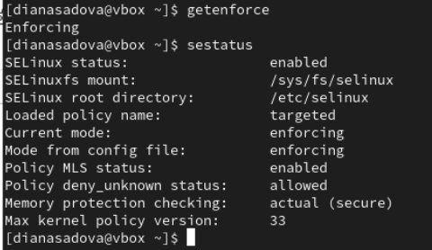

---
## Front matter
title: "Лабораторная работа № 6."
subtitle: "Мандатное разграничение прав в Linux"
author: "Диана Алексеевна Садова"

## Generic otions
lang: ru-RU
toc-title: "Содержание"

## Bibliography
bibliography: bib/cite.bib
csl: pandoc/csl/gost-r-7-0-5-2008-numeric.csl

## Pdf output format
toc: true # Table of contents
toc-depth: 2
lof: true # List of figures
lot: true # List of tables
fontsize: 12pt
linestretch: 1.5
papersize: a4
documentclass: scrreprt
## I18n polyglossia
polyglossia-lang:
  name: russian
  options:
	- spelling=modern
	- babelshorthands=true
polyglossia-otherlangs:
  name: english
## I18n babel
babel-lang: russian
babel-otherlangs: english
## Fonts
mainfont: PT Serif
romanfont: PT Serif
sansfont: PT Sans
monofont: PT Mono
mainfontoptions: Ligatures=TeX
romanfontoptions: Ligatures=TeX
sansfontoptions: Ligatures=TeX,Scale=MatchLowercase
monofontoptions: Scale=MatchLowercase,Scale=0.9
## Biblatex
biblatex: true
biblio-style: "gost-numeric"
biblatexoptions:
  - parentracker=true
  - backend=biber
  - hyperref=auto
  - language=auto
  - autolang=other*
  - citestyle=gost-numeric
## Pandoc-crossref LaTeX customization
figureTitle: "Рис."
tableTitle: "Таблица"
listingTitle: "Листинг"
lofTitle: "Список иллюстраций"
lotTitle: "Список таблиц"
lolTitle: "Листинги"
## Misc options
indent: true
header-includes:
  - \usepackage{indentfirst}
  - \usepackage{float} # keep figures where there are in the text
  - \floatplacement{figure}{H} # keep figures where there are in the text
---

# Цель работы

Развить навыки администрирования ОС Linux. Получить первое практическое знакомство с технологией SELinux1.

Проверить работу SELinx на практике совместно с веб-сервером Apache.

# Последовательность выполнения работы

1. Войдите в систему с полученными учётными данными и убедитесь, что SELinux работает в режиме enforcing политики targeted с помощью команд getenforce и sestatus.(рис. [-@fig:001]).

{#fig:001 width=90%}

2. Обратитесь с помощью браузера к веб-серверу, запущенному на вашем компьютере, и убедитесь, что последний работает:(рис. [-@fig:006]).

{#fig:006 width=90%}

3. Найдите веб-сервер Apache в списке процессов, определите его контекст безопасности и занесите эту информацию в отчёт. Например, можно использовать команду(рис. [-@fig:007]).

{#fig:007 width=90%}

4. Посмотрите текущее состояние переключателей SELinux для Apache c помощью команды(рис. [-@fig:009]).

{#fig:009 width=90%}

Обратите внимание, что многие из них находятся в положении «off».

5. Посмотрите статистику по политике с помощью команды seinfo, также определите множество пользователей, ролей, типов.(рис. [-@fig:010]).

{#fig:010 width=90%}

6. Определите тип файлов и поддиректорий, находящихся в директории /var/www, с помощью команды(рис. [-@fig:011]).

{#fig:011 width=90%}

7. Определите тип файлов, находящихся в директории /var/www/html:

Первый файл - устоновочный 

Второй файл - файл для веб-сервера (html)

8. Определите круг пользователей, которым разрешено создание файлов в директории /var/www/html.

Пользователь может совершать с файлом все действия (читать, редактировать, изменять), группа - только читать и изменять, сторонние пользователи только изменять.

9. Создайте от имени суперпользователя (так как в дистрибутиве после установки только ему разрешена запись в директорию) html-файл /var/www/html/test.html следующего содержания:(рис. [-@fig:012]).

{#fig:012 width=90%}

10. Проверьте контекст созданного вами файла. Занесите в отчёт контекст, присваиваемый по умолчанию вновь созданным файлам в директории /var/www/html.(рис. [-@fig:013]).

{#fig:013 width=90%}

11. Обратитесь к файлу через веб-сервер, введя в браузере адрес http://127.0.0.1/test.html. Убедитесь, что файл был успешно отображён.(рис. [-@fig:014]).

{#fig:014 width=90%}

12. Изучите справку man httpd_selinux и выясните, какие контексты файлов определены для httpd. Сопоставьте их с типом файла test.html. Проверить контекст файла можно командой ls -Z.

13. Измените контекст файла /var/www/html/test.html с httpd_sys_content_t на любой другой, к которому процесс httpd не
должен иметь доступа, например, на samba_share_t:(рис. [-@fig:015]).

{#fig:015 width=90%}

14. Попробуйте ещё раз получить доступ к файлу через веб-сервер, введя в браузере адрес http://127.0.0.1/test.html. Вы должны получить сообщение об ошибке.

Да, получили сообщение об ошибке.

15. Проанализируйте ситуацию. Почему файл не был отображён, если права доступа позволяют читать этот файл любому пользователю?

Просмотрите log-файлы веб-сервера Apache. Также просмотрите системный лог-файл:(рис. [-@fig:00]).

{#fig:00 width=90%}

Если в системе окажутся запущенными процессы setroubleshootd и audtd, то вы также сможете увидеть ошибки, аналогичные указанным выше, в файле /var/log/audit/audit.log. Проверьте это утверждение самостоятельно.

16. Попробуйте запустить веб-сервер Apache на прослушивание ТСР-порта 81 (а не 80, как рекомендует IANA и прописано в /etc/services). Для этого в файле /etc/httpd/httpd.conf найдите строчку Listen 80 и замените её на Listen 81.(рис. [-@fig:00]).

{#fig:00 width=90%}

17. Выполните перезапуск веб-сервера Apache. Произошёл сбой? Поясните почему?

\\\\\\\\\

18. Проанализируйте лог-файлы:(рис. [-@fig:00]).

{#fig:00 width=90%}

Просмотрите файлы /var/log/http/error_log, /var/log/http/access_log и /var/log/audit/audit.log и выясните, в каких файлах появились записи.

\\\\\\\\

19. Выполните команду(рис. [-@fig:00]).

{#fig:00 width=90%}

После этого проверьте список портов командой(рис. [-@fig:00]).

{#fig:00 width=90%}

Убедитесь, что порт 81 появился в списке.

20. Попробуйте запустить веб-сервер Apache ещё раз. Поняли ли вы, почему он сейчас запустился, а в предыдущем случае не смог?

\\\\\\\\\\\

21. Верните контекст httpd_sys_cоntent__t к файлу /var/www/html/ test.html:(рис. [-@fig:00]).

{#fig:00 width=90%}

После этого попробуйте получить доступ к файлу через веб-сервер, введя в браузере адрес http://127.0.0.1:81/test.html. Вы должны увидеть содержимое файла — слово «test».

22. Исправьте обратно конфигурационный файл apache, вернув Listen 80.

23. Удалите привязку http_port_t к 81 порту:(рис. [-@fig:00]).

{#fig:00 width=90%}

и проверьте, что порт 81 удалён.

24. Удалите файл /var/www/html/test.html:(рис. [-@fig:00]).

{#fig:00 width=90%}

# Выводы
\\\\\\\\\\\\\\\\\\\\
Развить навыки администрирования ОС Linux. Получить первое практическое знакомство с технологией SELinux1.

Проверить работу SELinx на практике совместно с веб-сервером Apache.

# Список литературы{.unnumbered}

::: {#refs}
:::
