---
## Front matter
lang: ru-RU
title: Индивидуальный проект. Этап 1.
subtitle: Установка Kali Linux
author:
  - Cадова Д. А.
institute:
  - Российский университет дружбы народов, Москва, Россия

## i18n babel
babel-lang: russian
babel-otherlangs: english
## Fonts
mainfont: PT Serif
romanfont: PT Serif
sansfont: PT Sans
monofont: PT Mono
mainfontoptions: Ligatures=TeX
romanfontoptions: Ligatures=TeX
sansfontoptions: Ligatures=TeX,Scale=MatchLowercase
monofontoptions: Scale=MatchLowercase,Scale=0.9

## Formatting pdf
toc: false
toc-title: Содержание
slide_level: 2
aspectratio: 169
section-titles: true
theme: metropolis
header-includes:
 - \metroset{progressbar=frametitle,sectionpage=progressbar,numbering=fraction}
 - '\makeatletter'
 - '\beamer@ignorenonframefalse'
 - '\makeatother'
---

# Информация

## Докладчик

:::::::::::::: {.columns align=center}
::: {.column width="70%"}

  * Садова Диана Алексеевна
  * студент бакалавриата
  * Российский университет дружбы народов
  * [113229118@pfur.ru]
  * <https://DianaSadova.github.io/ru/>

:::
::::::::::::::

# Вводная часть

## Актуальность

- Установите дистрибутив Kali Linux в виртуальную машину в качестве среды виртуализации предлагается использовать VirtualBox.

## Цели и задачи

- Целью данной работы является установка системы Kali Linux 

## Материалы и методы

- Опыт прошлого года в настройке виртуальных машин

## Содержание исследования

- Устанавливаем виртуальную машину 

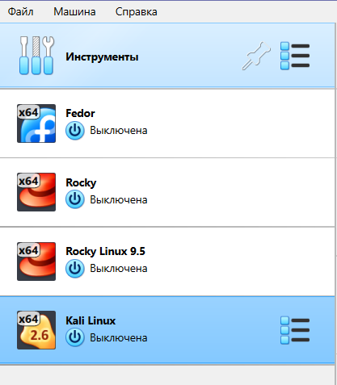

##

- Устанавливаем основную память, жёсткий диск, процессор

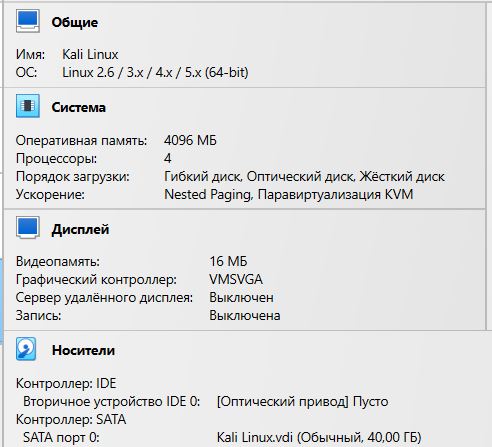

##

- Снимаем галочку с "Гибкий диск" 

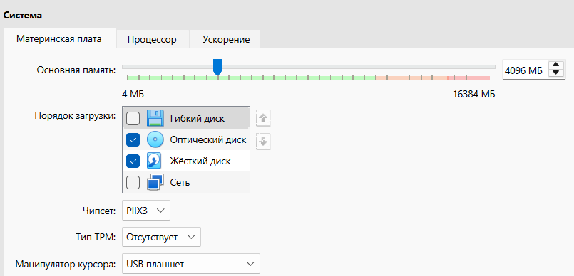

##

- Устанавливаем оптичиский диск, заранее скаченый

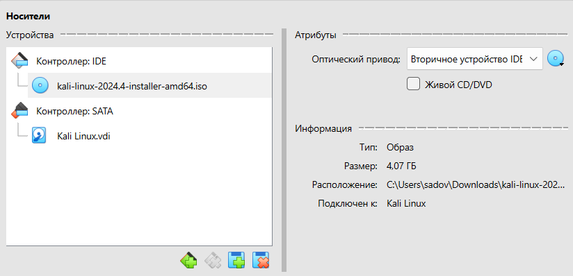

##

- Проверяем настройки сети и тип подключения. Он должен быть NAT

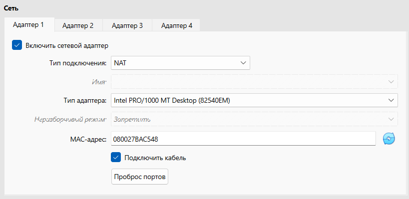

##

- Запускаем систему и начинаем установку Kali, я устонавливала через графический интерфейс

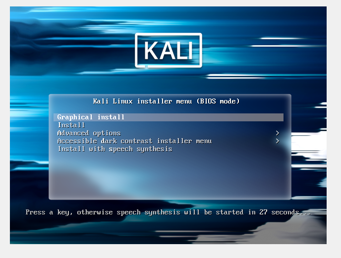

##

- Выбераем язык 

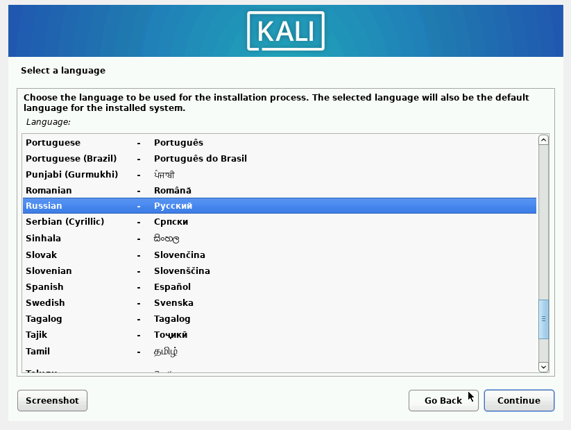

##

- Настраиваем клавиотуру

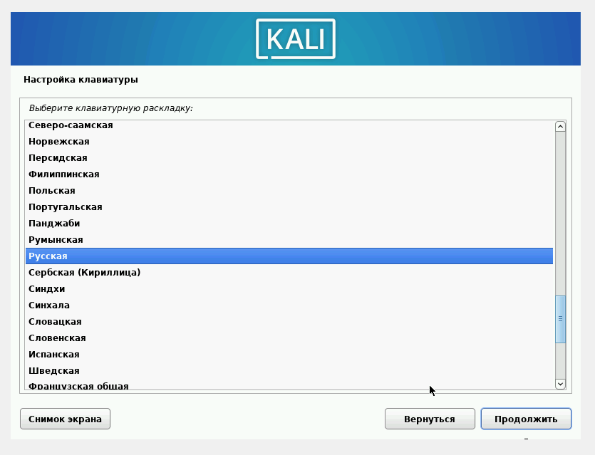

#

- Выбераем имя компьютора в сети. Я оставила изночальное "vbox"

##

- Создаем учетную запись пользователя 

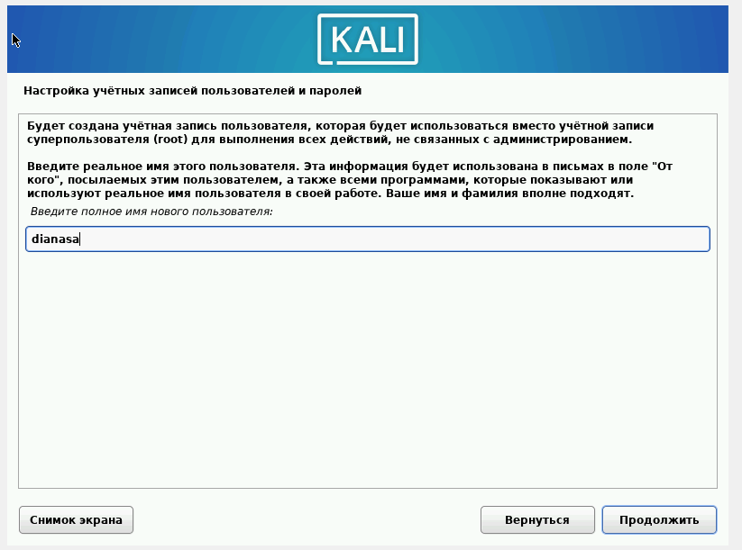

##

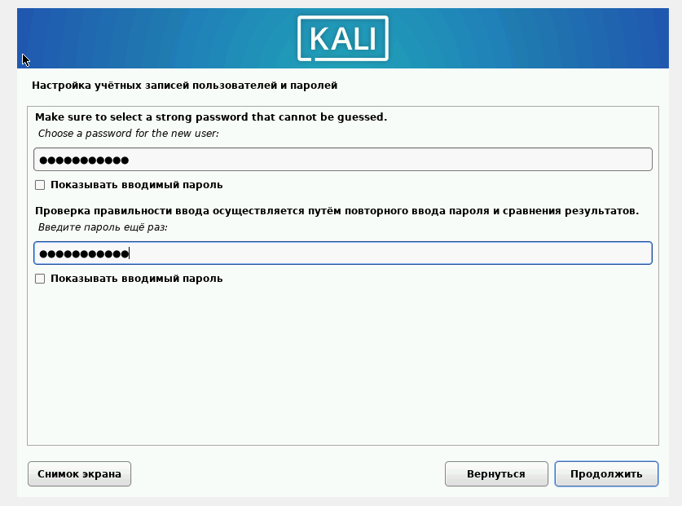

##

- Выбераем режим как мы будем использовать диск. У меня авто 

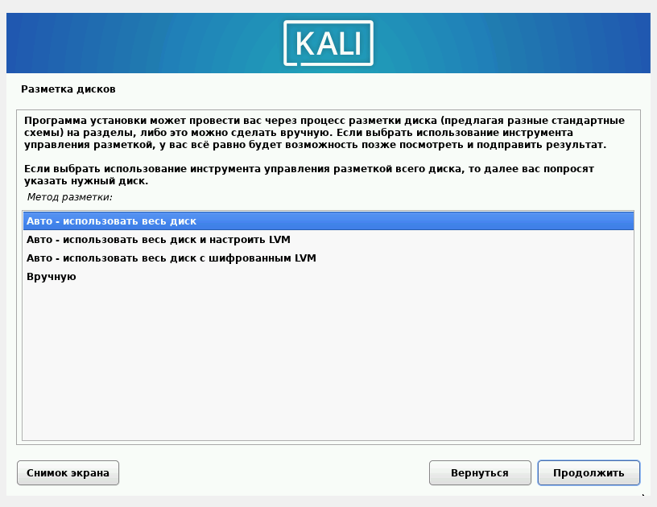

##

- Сохраняем изменения 

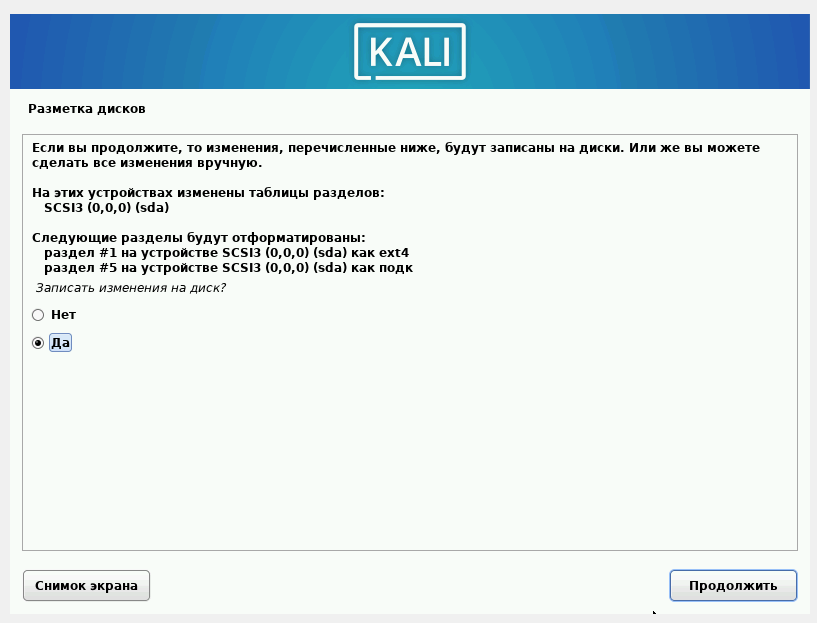

##

- Устанавливаем системного загрузчика GRUB 

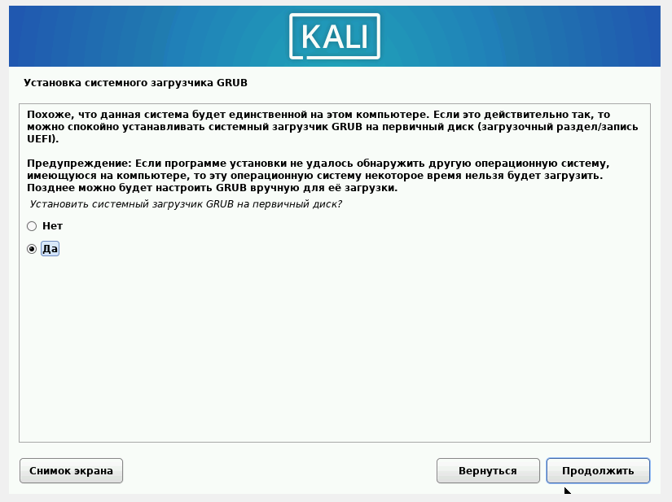

##

- Указываем на наше устройстко для полной загрузки 

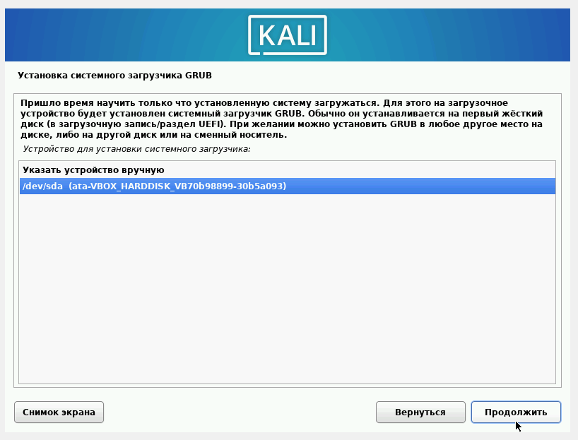

##

- Завершаем установку Kali Linux 

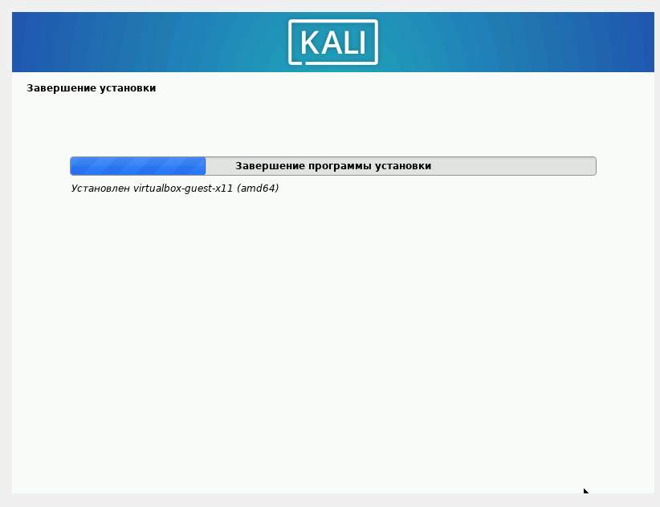

##

- Заходим и автаризуемся в нашей новой вертуальной машине. Установка завершена 

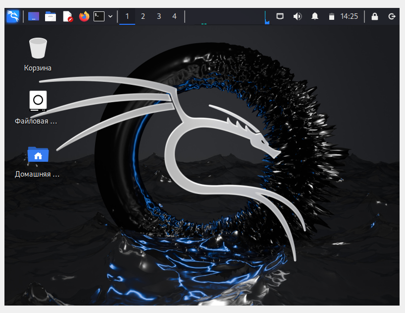

## Результаты

- Мы приобрели практические навыки установки операционной системы на виртуальную машину, настройки минимально необходимых для дальнейшей работы сервисов.

