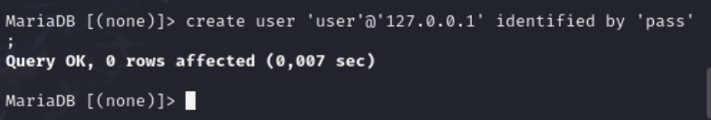

---
## Front matter
lang: ru-RU
title: Индивидуальный проект. Этап 2.
subtitle: Установка DVWA
author:
  - Cадова Д. А.
institute:
  - Российский университет дружбы народов, Москва, Россия

## i18n babel
babel-lang: russian
babel-otherlangs: english
## Fonts
mainfont: PT Serif
romanfont: PT Serif
sansfont: PT Sans
monofont: PT Mono
mainfontoptions: Ligatures=TeX
romanfontoptions: Ligatures=TeX
sansfontoptions: Ligatures=TeX,Scale=MatchLowercase
monofontoptions: Scale=MatchLowercase,Scale=0.9

## Formatting pdf
toc: false
toc-title: Содержание
slide_level: 2
aspectratio: 169
section-titles: true
theme: metropolis
header-includes:
 - \metroset{progressbar=frametitle,sectionpage=progressbar,numbering=fraction}
 - '\makeatletter'
 - '\beamer@ignorenonframefalse'
 - '\makeatother'
---

# Информация

## Докладчик

:::::::::::::: {.columns align=center}
::: {.column width="70%"}

  * Садова Диана Алексеевна
  * студент бакалавриата
  * Российский университет дружбы народов
  * [113229118@pfur.ru]
  * <https://DianaSadova.github.io/ru/>

:::
::::::::::::::

# Вводная часть

## Актуальность

- Устанавливаем DVWA для работы с безопасностью сайта.

## Цели и задачи

- Установите DVWA в гостевую систему к Kali Linux.

## Материалы и методы

- Источники Интернета.

## Содержание исследования

- Перейдите в каталог www 

##

- Клонируйте репозиторий git:

##

Измените права доступа к папке установки 

##

Перейдите к файлу конфигурации в каталоге установки:

##

Скопируйте файл конфигурации и переименуйте его:

##

Откройте файл настроек и измените пароль на что-то более простое для ввода (я изменю пароль на pass):

##

На следующем снимке экрана показано содержимое файла конфигурации, включая всю информацию о базе данных:

##

Установите mariadb:

##

##

Запустите базу данных:

##

Войдите в базу данных (пароля нет, поэтому просто нажмите Enter при появлении запроса)

##

Создайте пользователя базы данных. Нужно использовать те же имя пользователя и пароль, которые использовались в файле конфигурации (см. скрин выше):

##

Предоставьте пользователю все привилегии:

##

Пришло время перейти в каталог apache2 для настройки сервера Apache:

##

Откройте для редактирования файл php.ini, чтобы включить следующие параметры: allow_url_fopen и allow_url_include.

##

##

Запустите сервер Apache:

##

Если все сделали правильно, то можно открыть DVWA в браузере, введя в адресной строке следующее:

##

Если открылась страница настройки, это означает, что вы успешно установили DVWA на Kali Linux 

## Результаты

- Мы смогли установить DVWA в гостевую систему к Kali Linux.

