---
## Front matter
title: " Индивидуальный проект. Этап 2."
subtitle: "Установка DVWA"
author: "Диана Алексеевна Садова"

## Generic otions
lang: ru-RU
toc-title: "Содержание"

## Bibliography
bibliography: bib/cite.bib
csl: pandoc/csl/gost-r-7-0-5-2008-numeric.csl

## Pdf output format
toc: true # Table of contents
toc-depth: 2
lof: true # List of figures
lot: true # List of tables
fontsize: 12pt
linestretch: 1.5
papersize: a4
documentclass: scrreprt
## I18n polyglossia
polyglossia-lang:
  name: russian
  options:
	- spelling=modern
	- babelshorthands=true
polyglossia-otherlangs:
  name: english
## I18n babel
babel-lang: russian
babel-otherlangs: english
## Fonts
mainfont: PT Serif
romanfont: PT Serif
sansfont: PT Sans
monofont: PT Mono
mainfontoptions: Ligatures=TeX
romanfontoptions: Ligatures=TeX
sansfontoptions: Ligatures=TeX,Scale=MatchLowercase
monofontoptions: Scale=MatchLowercase,Scale=0.9
## Biblatex
biblatex: true
biblio-style: "gost-numeric"
biblatexoptions:
  - parentracker=true
  - backend=biber
  - hyperref=auto
  - language=auto
  - autolang=other*
  - citestyle=gost-numeric
## Pandoc-crossref LaTeX customization
figureTitle: "Рис."
tableTitle: "Таблица"
listingTitle: "Листинг"
lofTitle: "Список иллюстраций"
lotTitle: "Список таблиц"
lolTitle: "Листинги"
## Misc options
indent: true
header-includes:
  - \usepackage{indentfirst}
  - \usepackage{float} # keep figures where there are in the text
  - \floatplacement{figure}{H} # keep figures where there are in the text
---

# Цель работы

Установите DVWA в гостевую систему к Kali Linux.

# Последовательность выполнения работы

Перейдите в каталог www (рис. [-@fig:001]).

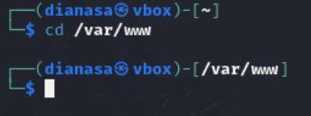{#fig:001 width=90%}

Клонируйте репозиторий git:(рис. [-@fig:002]).

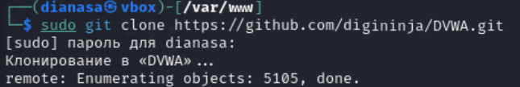{#fig:002 width=90%}

Измените права доступа к папке установки (рис. [-@fig:003]).

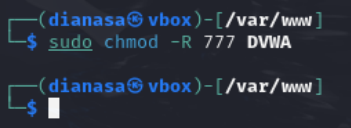{#fig:003 width=90%}

Перейдите к файлу конфигурации в каталоге установки:(рис. [-@fig:004]).

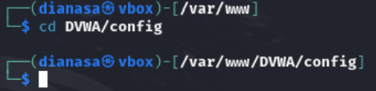{#fig:004 width=90%}

Скопируйте файл конфигурации и переименуйте его:(рис. [-@fig:005]).

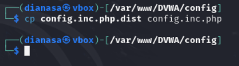{#fig:005 width=90%}

Откройте файл настроек и измените пароль на что-то более простое для ввода (я изменю пароль на pass):(рис. [-@fig:006]).

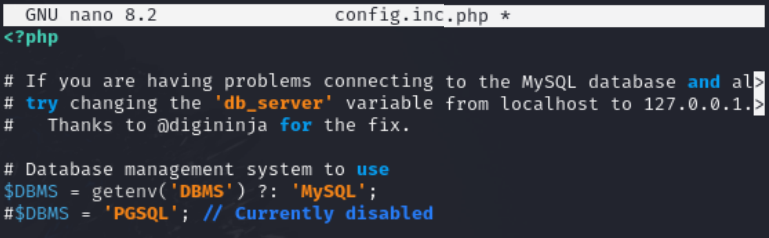{#fig:006 width=90%}

На следующем снимке экрана показано содержимое файла конфигурации, включая всю информацию о базе данных:(рис. [-@fig:007]).

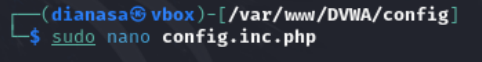{#fig:007 width=90%}

Установите mariadb:(рис. [-@fig:008]),(рис. [-@fig:009]).

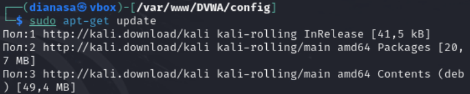{#fig:008 width=90%}

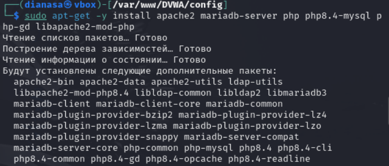{#fig:009 width=90%}

Запустите базу данных:(рис. [-@fig:010]).

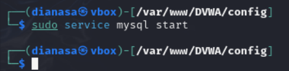{#fig:010 width=90%}

Войдите в базу данных (пароля нет, поэтому просто нажмите Enter при появлении запроса):(рис. [-@fig:011]).

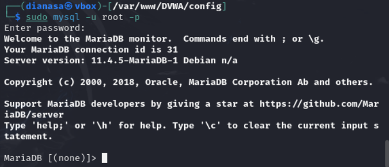{#fig:011 width=90%}

Создайте пользователя базы данных. Нужно использовать те же имя пользователя и пароль, которые использовались в файле конфигурации (см. скрин выше):(рис. [-@fig:012]).

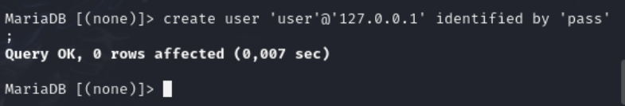{#fig:012 width=90%}

Предоставьте пользователю все привилегии:(рис. [-@fig:013]).

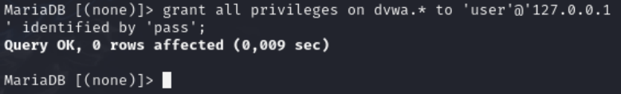{#fig:013 width=90%}

Пришло время перейти в каталог apache2 для настройки сервера Apache:(рис. [-@fig:014]).

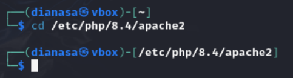{#fig:014 width=90%}

Откройте для редактирования файл php.ini, чтобы включить следующие параметры: allow_url_fopen и allow_url_include:(рис. [-@fig:015]),(рис. [-@fig:016]).

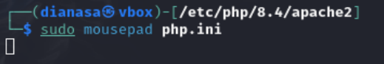{#fig:015 width=90%}

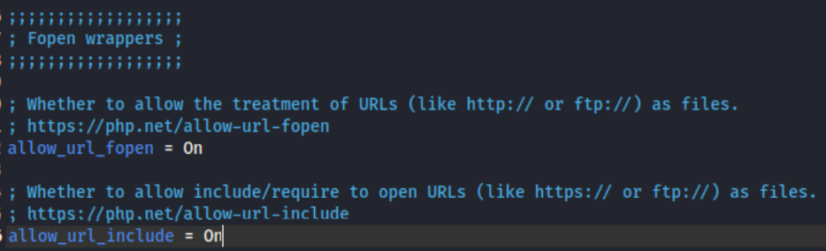{#fig:016 width=90%}

Запустите сервер Apache:(рис. [-@fig:017]).

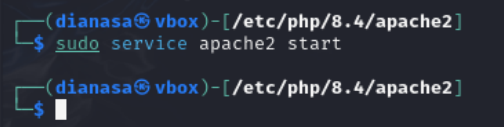{#fig:017 width=90%}

Если все сделали правильно, то можно открыть DVWA в браузере, введя в адресной строке следующее:(рис. [-@fig:018]).

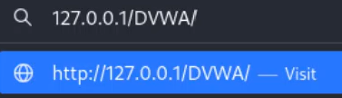{#fig:018 width=90%}

Если открылась страница настройки, это означает, что вы успешно установили DVWA на Kali Linux (рис. [-@fig:019]).

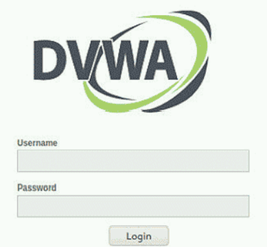{#fig:019 width=90%}

# Выводы

Мы смогли установить DVWA в гостевую систему к Kali Linux.

# Список литературы{.unnumbered}

::: {#refs}
:::
