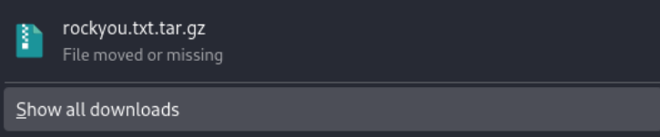
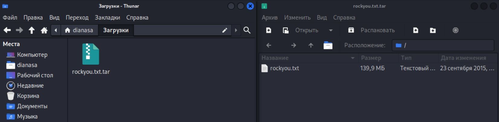
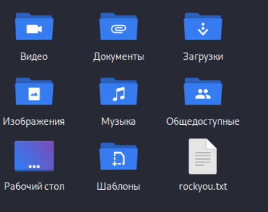
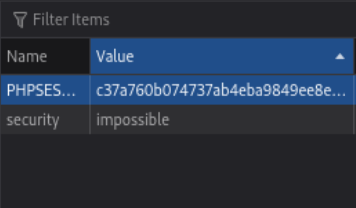
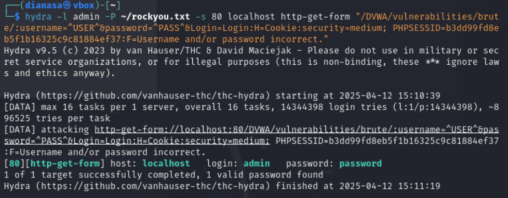
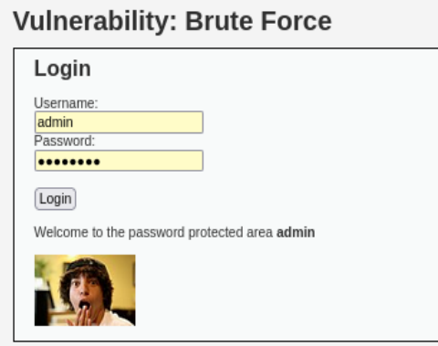

---
## Front matter
lang: ru-RU
title: Индивидуальный проект. Этап 3.
subtitle: Использование Hydra
author:
  - Cадова Д. А.
institute:
  - Российский университет дружбы народов, Москва, Россия

## i18n babel
babel-lang: russian
babel-otherlangs: english
## Fonts
mainfont: PT Serif
romanfont: PT Serif
sansfont: PT Sans
monofont: PT Mono
mainfontoptions: Ligatures=TeX
romanfontoptions: Ligatures=TeX
sansfontoptions: Ligatures=TeX,Scale=MatchLowercase
monofontoptions: Scale=MatchLowercase,Scale=0.9

## Formatting pdf
toc: false
toc-title: Содержание
slide_level: 2
aspectratio: 169
section-titles: true
theme: metropolis
header-includes:
 - \metroset{progressbar=frametitle,sectionpage=progressbar,numbering=fraction}
 - '\makeatletter'
 - '\beamer@ignorenonframefalse'
 - '\makeatother'
---

# Информация

## Докладчик

:::::::::::::: {.columns align=center}
::: {.column width="70%"}

  * Садова Диана Алексеевна
  * студент бакалавриата
  * Российский университет дружбы народов
  * [113229118@pfur.ru]
  * <https://DianaSadova.github.io/ru/>

:::
::::::::::::::

# Вводная часть

## Актуальность

- Разобратся в Hydra и взломать пользователя (меня).

## Цели и задачи

- Разобратся в работе Hydra и взломать пользовательскую запись на DVWA.

## Материалы и методы

- Источники Интернета.

## Содержание исследования

1. Скачать словарь можно с GitHub. Архив весит 50.8мб. 

##

2. Разархивируем его на рабочий стол 

##

##

3. Переходим в окно DVWA и открываем панель кода страници (Важно: перед открытием обновите страницу). Нам нужна вкладка Cookies. Находим PHPSESSID и копируем строку Value

##

4. Переходим в консоль и используем заготовленую строку с ТУИС для работы Hydra. Добавляем на место PHPSESSID, полученный из предыдущего шага, код и запускаем программу. У нас должно вывестись логин и пароль от пользователя (меня) к сайту DVWA

##

5. Проверяем правильность пароля и логина 

## Результаты

- Мы смогли разобратся с работой Hydra и достать пароль и логин пользователя (меня).

