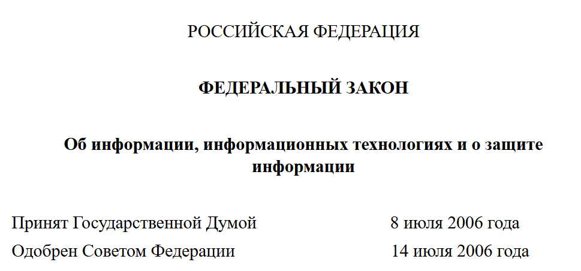
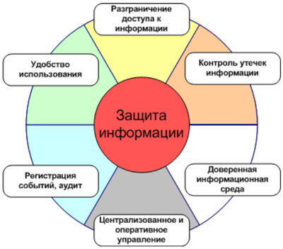
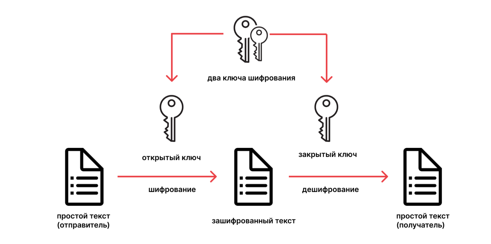

---
## Front matter
lang: ru-RU
title: Доклад
subtitle: Тема «Государственная система защиты информации»
author:
  - Cадова Д. А.
  - Кулябов Дмитрий Сергеевич. Доцент по кафедре систем телекоммуникаций. Доктор физико-математических наук по специальности 05.13.18 «Математическое моделирование, численные методы и комплексы программ». Профессор кафедры прикладной информатики и теории вероятностей РУДН. Заведующий сектором Управления информационно-технологического обеспечения, слаботочных и телекоммуникационных систем РУДН (по совместительству). 
institute:
  - Российский университет дружбы народов, Москва, Россия

## i18n babel
babel-lang: russian
babel-otherlangs: english
## Fonts
mainfont: PT Serif
romanfont: PT Serif
sansfont: PT Sans
monofont: PT Mono
mainfontoptions: Ligatures=TeX
romanfontoptions: Ligatures=TeX
sansfontoptions: Ligatures=TeX,Scale=MatchLowercase
monofontoptions: Scale=MatchLowercase,Scale=0.9

## Formatting pdf
toc: false
toc-title: Содержание
slide_level: 2
aspectratio: 169
section-titles: true
theme: metropolis
header-includes:
 - \metroset{progressbar=frametitle,sectionpage=progressbar,numbering=fraction}
 - '\makeatletter'
 - '\beamer@ignorenonframefalse'
 - '\makeatother'
---

## Информация о докладчике

:::::::::::::: {.columns align=center}
::: {.column width="70%"}

  * Садова Диана Алексеевна
  * студент бакалавриата
  * Российский университет дружбы народов
  * [113229118@pfur.ru]
  * <https://DianaSadova.github.io/ru/>
  
:::
::: {.column width="30%"}

:::
::::::::::::::

## Актуальность

- Актуальность темы обусловлена стремительным развитием цифровых технологий, увеличением кибер-угроз и необходимостью обеспечения защиты государственной, коммерческой и личной информации. Государственные органы играют ключевую роль в создании и регулировании системы информационной безопасности.

## Цели и задачи

- Целью данного доклада является изучение государственной системы защиты информации, её правовых основ, направлений деятельности.

## Материалы и методы

- Материалы находящиеся на просторах Internet

## Введение

- С развитием технологий возрастают угрозы кибератак, утечек данных и информационного шпионажа. Для обеспечения защиты информации государству необходимо внедрять нове методы кибербезопасности и совершенствовать законодательство в области защиты данных.

## Основы государственной системы защиты информации 

:::::::::::::: {.columns align=center}
::: {.column width="50%"}

Государственная система защиты информации — совокупность органов и исполнителей, используемой ими техники защиты информации, а также объектов защиты. Она является частью системы обеспечения национальной безопасности Российской Федерации и призвана защищать государство от внешних и внутренних угроз в информационной сфере.

:::
::: {.column width="50%"}

:::
::::::::::::::

## Некоторые основы государственной системы защиты информации:

:::::::::::::: {.columns align=center}
::: {.column width="50%"}

 1. Законодательные акты. Функционирование системы основано на Конституции РФ, ФЗ «О безопасности», «О государственной тайне», «Об информации, информатизации и защите информации» и других документах. 
 
 2. Доктрина информационной безопасности. Она представляет собой систему официальных взглядов на обеспечение национальной безопасности РФ в информационной сфере. 
 
:::
::: {.column width="50%"}

:::
::::::::::::::

##

:::::::::::::: {.columns align=center}
::: {.column width="50%"}

 3. Положение о государственной системе защиты информации. Структура и основные функции системы определены в этом документе, утверждённом Постановлением Правительства от 15 сентября 1993 года №912-51. 
 

 4. Организационная основа. В неё входят Совет Федерации Федерального Собрания РФ, Государственная Дума, Правительство РФ, Совет Безопасности РФ и другие органы. 
 
:::
::: {.column width="50%"}

:::
:::::::::::::: 
## Некоторые задачи государственной системы защиты информации:

:::::::::::::: {.columns align=center}
::: {.column width="50%"}

 1. проведение единой технической политики, организация и координация работ по защите информации в разных сферах деятельности; 
 
 2. исключение или существенное затруднение добывания информации техническими средствами разведки, предотвращение её утечки по техническим каналам, несанкционированного доступа к ней; 
 
:::
::: {.column width="50%"}

:::
::::::::::::::

##

:::::::::::::: {.columns align=center}
::: {.column width="50%"}

 3. принятие в пределах компетенции нормативно-правовых актов, регулирующих отношения в области защиты информации; 
 
 4. организация сил, создание средств защиты информации и контроля эффективности её защиты; 
 
 5. контроль за проведением работ по защите информации в органах государственного управления, объединениях, на предприятиях, в организациях и учреждениях. 
 
:::
::: {.column width="50%"}

:::
::::::::::::::

## Основные направления государственной защиты информации

:::::::::::::: {.columns align=center}
::: {.column width="50%"}

Криптографическая защита информации. Криптографические методы защиты включают шифрование данных, использование цифровых подписей и сертификатов безопасности, что позволяет обеспечить конфиденциальность и подлинность информации.
 
:::
::: {.column width="50%"}

:::
::::::::::::::

##

:::::::::::::: {.columns align=center}
::: {.column width="50%"}

Техническая защита информации. К техническим методам относятся контроль доступа, мониторинг сетевой безопасности, антивирусные системы, системы обнаружения вторжений и аппаратные средства защиты.

:::
::: {.column width="50%"}

:::
::::::::::::::
##

Организационные меры. Организационные меры включают классификацию данных, обучение персонала, разработку политик безопасности и аудит информационной безопасности.

## Органы государственной власти, отвечающие за защиту информации

:::::::::::::: {.columns align=center}
::: {.column width="50%"}

Федеральная служба безопасности (ФСБ). ФСБ России занимается обеспечением государственной безопасности, включая защиту государственных секретов и борьбу с киберпреступностью.

:::
::: {.column width="50%"}

:::
::::::::::::::

##
:::::::::::::: {.columns align=center}
::: {.column width="50%"}

Федеральная служба по техническому и экспортному контролю (ФСТЭК). ФСТЭК разрабатывает нормативные документы и контролирует выполнение требований по технической защите информации в государственных и частных организациях.

:::
::: {.column width="50%"}

:::
::::::::::::::

##

Министерство цифрового развития, связи и массовых коммуникаций. Министерство отвечает за регулирование цифровой инфраструктуры, разработку стандартов и внедрение современных технологий защиты информации.

## Заключение

Государственная система защиты информации играет важную роль в обеспечении безопасности страны, её граждан и организаций. Эффективная защита информации требует комплексного подхода, включающего правовые, технические и организационные меры. Современные вызовы требуют постоянного совершенствования систем защиты и внедрения инновационных технологий.

# Список литературы{.unnumbered}

 1. Федеральный закон РФ «О защите информации» № 149-ФЗ.
 
 2. Федеральный закон РФ «О персональных данных» № 152-ФЗ.
 
 3. Закон РФ «О государственной тайне» № 5485-1.
 
 4. ГОСТ Р 50922-96. Защита информации. Основные термины и определения.
 
 5. Официальный сайт ФСТЭК России. URL: https://fstec.ru 
 
 6. Официальный сайт ФСБ России. URL: https://fsb.ru 
